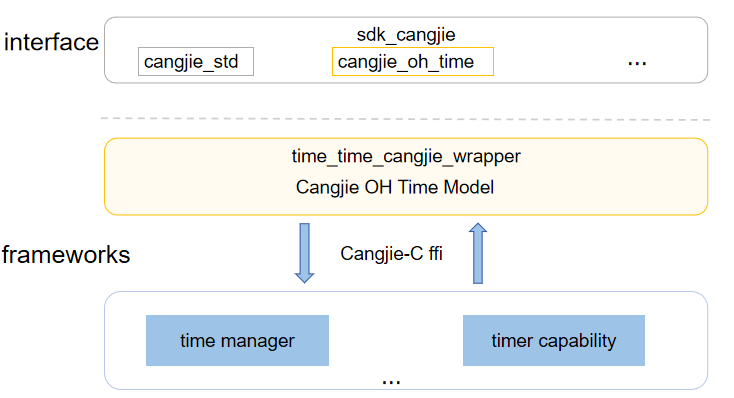

# time_cangjie_wrapper

## Introduction

 The time_cangjie_wrapper is a Cangjie API encapsulated on OpenHarmony based on the capabilities of the time and time zone subsystem. The time and time zone subsystem provides OpenHarmony with the capability of managing the system time, time zone, and timing.

-   **Time and time zone management**

    Manages the system time and time zone in a unified manner, including setting and obtaining the system time, date, and time zone, and obtaining the system startup time.

-   **Timing management**

    Provides the system timer capability, including creating, starting, stopping, and destroying timers. There are three types of timers: system startup timer, system time timer, and wakeup timer.


## System Architecture

**Figure 1** Architecture of the time_cangjie_wrapper




## Directory Structure

The source code of the time and time zone subsystem is stored in the **/base/time** directory.

The directory structure is as follows:

```
base/time/time_cangjie_wrapper
├── ohos             # Cangjie Time and Time Zone Subsystem code
├── figures          # architecture pictures
```

## Repositories Involved

[time_service](https://gitee.com/openharmony/time_time_service/blob/master/README.md)
